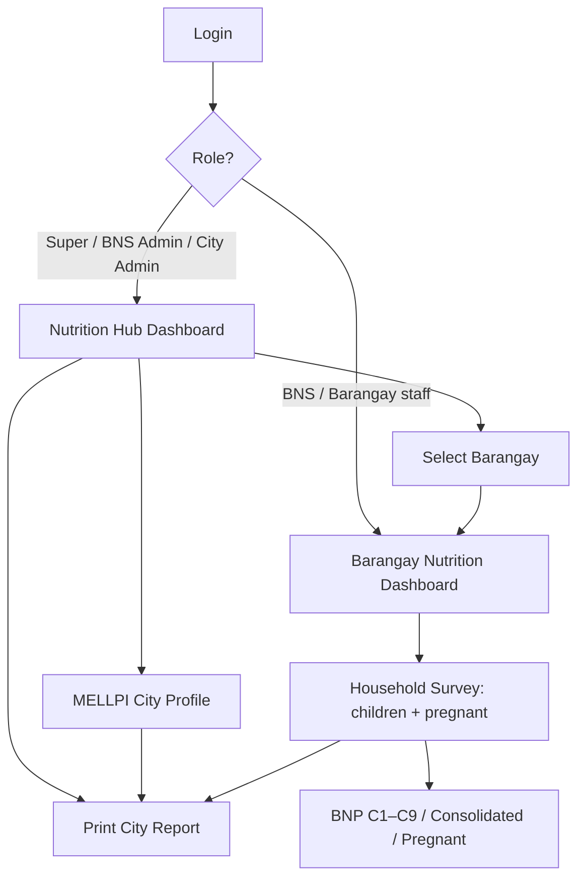

# Nutrition Portal — User Guide

**System:** Nutrition Portal · Valencia City, Bukidnon  
**Guide version:** 2026.08.13b  
**Audience:** Nutrition Super Admin, SSA, Nutrition Admin (A), CNPC, BNS, City Super Admin, City Admin  
**Local base URL:** `http://localhost/barangay_default/`

> **Maintainer rule:** Any Nutrition Portal system update must also update [`admin/nutritionHubGuidePrint.php`](../admin/nutritionHubGuidePrint.php) (and this file). Bump the guide version and recapture affected screenshots.

Screenshots live in [`nutrition-hub/screenshots/`](nutrition-hub/screenshots/). Drop PNG files using the names in each step (see that folder’s [README](nutrition-hub/screenshots/README.md)).

**PDF form:** open [`admin/nutritionHubGuidePrint.php`](../admin/nutritionHubGuidePrint.php) (Nutrition Portal → **User Guide (PDF)**). Use **Print** or **Download PDF**. Auto-download: `nutritionHubGuidePrint.php?download=1`.

**Process Form (SOP PDF):** open [`admin/nutritionProcessFormPrint.php`](../admin/nutritionProcessFormPrint.php) (Nutrition Portal → **Process Form (PDF)**). Includes end-to-end processes, school/Form C1 data sources, monthly checklist, and sign-off. Auto PDF: `nutritionProcessFormPrint.php?download=1`.

---

## Table of contents

1. [Overview & portals](#1-overview--portals)
2. [Roles and access](#2-roles-and-access)
3. [Getting started — login](#3-getting-started--login)
4. [City Nutrition Portal (Hub)](#4-city-nutrition-portal-hub)
5. [Barangay Nutrition Portal](#5-barangay-nutrition-portal)
6. [BNP Template 2026 (C1–C9)](#6-bnp-template-2026-c1c9)
7. [City print report (MELLPI + BNP + e-OPT)](#7-city-print-report-mellpi--bnp--e-opt)
8. [End-to-end workflow](#8-end-to-end-workflow)
9. [Quick URL reference](#9-quick-url-reference)
10. [Screenshot index](#10-screenshot-index)
11. [System update log](#11-system-update-log)

---

## 1. Overview & portals

Valencia City uses two separate portals. Branding follows the account and the active portal:

| Portal | Brand name | Purpose |
|--------|------------|---------|
| **City of Valencia Portal** | City of Valencia Portal | Barangay administration (residents, officials, certificates, blotter, settings) |
| **Nutrition Portal** (city hub) | Nutrition Portal | City dashboard, MELLPI CM, city print reports, BNS accounts, barangay picker |
| **Nutrition Portal** (barangay) | Nutrition Portal · *barangay name* | Household surveys, child assessments (ages **0–19**), BNP C1–C9, pregnant reports |

**Important:** Nutrition-only accounts never open City of Valencia (barangay admin) menus. Profile editing stays inside Nutrition Portal (`nutritionAccountProfile.php`).

Data entered per barangay (household surveys with children and pregnant/lactating members) rolls up into city reports.

---

## 2. Roles and access

### 2.0 System rules (definition)

Official access rules:

| Role | Access level / scope | Key capabilities |
|------|----------------------|------------------|
| **Super Super Admin (SSA)** | Full system (global) | Unlimited control across **all portals**; full account / survey / settings management; all reports |
| **Super Admin (SA)** | Hub level — **Barangay Hub** *or* **Nutrition Portal** | Full admin inside assigned hub only; manage users/settings in that unit; reports for that domain |
| **Admin (A)** | Nutrition Portal | **Add** new Household Surveys; **edit** and **delete** existing surveys; generate reports |
| **CNPC** | Nutrition Portal (assigned barangays) | **Edit** and **delete** existing Household Surveys; **cannot add** new surveys; generate reports |
| **BNS** | Nutrition Portal (one barangay) | **Entry only:** add new Household Surveys; **cannot** edit or delete; generate reports |

**Also enforced**

- **Barangay Super Admin (SA)** (`super_admin`) — Barangay Hub only (mirror of Nutrition SA for the other portal).
- **Barangay Admin (A)** (`admin`) — Barangay Hub view + add; no edit/delete of barangay records; no Nutrition Portal.
- Only **SSA** may switch freely between both portals.

**Account management (user accounts)**

| Role | Create / manage staff accounts |
|------|--------------------------------|
| **SSA** | **Yes — system-wide** across all levels, hubs, and portals |
| **Super Admin (SA)** | **Yes — within assigned hub only** (Barangay Hub *or* Nutrition Portal domain) |
| **Admin (A), CNPC, BNS** | **No** — restricted to Household Survey data and reports |

Scoped Super Admin create rules:

- **Nutrition SA** may create/manage Nutrition Admin (A), CNPC, and BNS (not Nutrition SA peers; those are SSA-only).
- **Barangay Hub SA** may create/manage Barangay Admin / staff roles inside the Barangay Hub (not Nutrition roles).

**Household survey actions**

| Action | SSA / Nutrition SA | Nutrition Admin (A) | CNPC | BNS |
|--------|--------------------|---------------------|------|-----|
| View / generate reports | Yes | Yes | Yes | Yes |
| Add new survey | Yes | Yes | **No** | Yes |
| Edit survey / names | Yes | Yes | Yes | No |
| Delete survey | Yes | Yes | Yes | No |
| Create / manage user accounts | Yes (SSA global · SA hub-scoped) | **No** | **No** | **No** |

### 2.1 Role matrix

| Role | Staff code | Nutrition Portal | City of Valencia Portal | Household surveys |
|------|------------|------------------|-------------------------|-------------------|
| **SSA** | `ssa` | Full | Full | Add · edit · delete |
| **Nutrition Super Admin (SA)** | `nutrition_super_admin` | Full (Nutrition only) | **No** | Add · edit · delete |
| **Nutrition Admin (A)** | `barangay_nutrition_scholar_admin` | Nutrition only | **No** | Add · edit · delete |
| **CNPC** | `city_nutrition_program_coordinator` | Assigned barangays | No | Edit · delete — **no add** |
| **BNS** | `barangay_nutrition_scholar` | One assigned barangay | No | Add only |
| **Barangay Super Admin (SA)** | `super_admin` | **No** | Full (Barangay only) | N/A (barangay records) |
| **Barangay Admin (A)** | `admin` | **No** | View + add (Barangay only) | N/A — no edit/delete barangay records |

---

## 3. Getting started — login

### Steps

1. Open `http://localhost/barangay_default/login.php` (brand: **City of Valencia Portal**).
2. Sign in with the correct credentials.
3. **Nutrition Super Admin** (`nutrition.superadmin`) lands directly on **Nutrition Portal** city dashboard.
4. **SSA only:** from City of Valencia Super Admin (`admin/superDashboard.php`), click **Switch to Nutrition Hub**.
5. Confirm the left sidebar shows **Nutrition Portal** (not City of Valencia Portal menus).

---

## 4. City Nutrition Portal (Hub)

### 4.1 Super Admin Nutrition Dashboard

**URL:** `admin/nutritionSuperDashboard.php`

**Steps**

1. Confirm the left sidebar shows **Nutrition Portal**.
2. Review **City Overview** cards (see table below).
3. Use **Quick Actions** or the barangay table to open a barangay, MELLPI, or print reports.
4. **Nutrition Admin (A):** click **Encode Survey** on a barangay row (or **Open** then sidebar → Household Survey). A barangay must be selected before encoding.
5. My Profile opens Nutrition Account Profile (stays inside Nutrition Portal).

**City Overview figures**

| Card | Meaning |
|------|---------|
| Barangays | Number of barangays in Valencia City |
| Children (0–19) | Residents aged **0–19** (nutrition only; City of Valencia Portal still uses 0–17 for barangay children stats) |
| Assessed | Children with at least one nutrition assessment |
| Pending Assessment | Children not yet assessed |
| At-Risk Cases | Sum of latest assessment statuses that are not Normal (Underweight, Wasted, Severely Wasted, Stunted, Overweight, Obese) |
| Assessments This Month | Assessments recorded in the current month |
| Household Surveys | Registered household nutrition surveys |
| Pregnant | All pregnant individuals from household surveys |
| Teenage Pregnant | Pregnant individuals marked status **Teenage** (BNP column B) |

**Sidebar menu (city)**

| Menu item | Action |
|-----------|--------|
| Super Admin Dashboard | City overview |
| Select Barangay | Open nutrition barangay picker |
| MELLPI City Profile | Register MELLPI PRO FORM CM |
| Print City Report | MELLPI + BNP C1–C9 + e-OPT Plus (new tab) |
| User Guide (PDF) | Printable manual — keep updated when the system changes |
| Switch to Barangay Hub | Back to City of Valencia Portal (City Super Admin only; hidden for Nutrition Super Admin) |
| Users → Nutrition SA / Admin (A) / CNPC / BNS | Nutrition staff accounts (see §2) |
| My Profile | Nutrition Account Profile only |

---

### 4.2 Select a barangay

**URL:** `admin/barangayHub.php?picker=1&system=nutrition&view=picker`

**Steps**

1. From the Hub sidebar click **Select Barangay**, or use Quick Action **Open Barangay Nutrition**.
2. Use search and filters: All · With Surveys · Has Pending · At-Risk · Teenage Pregnant · No Surveys Yet.
3. Each card shows children, assessed, surveys, teenage pregnant, and coverage %.
4. Click **Open Nutrition Dashboard** for that barangay (`nutritionDashboard.php`).
5. Nutrition Super Admin does not see the City of Valencia Portal switch on this page.

---

### 4.3 MELLPI City Profile registration

**URL:** `admin/nutritionMellpiCityProfile.php`

Register the **MELLPI PRO FORM CM — City/Municipality Profile Sheet** for Valencia City.

**Steps**

1. Hub sidebar → **MELLPI City Profile**.
2. Review sections: community identity, population snapshot, preschool/school nutritional status, pregnant status, BNS, hazards, land use.
3. Fields marked as live may autofill from household surveys; fill remaining blanks.
4. Click **Save**.
5. Optionally open **City Report** to preview MELLPI in the print pack.

---

### 4.4 Print City Report

See [Section 7](#7-city-print-report-mellpi--bnp--e-opt).

---

### 4.5 City pregnant families report

**URL:** `admin/nutritionSuperPregnantFamiliesPrint.php`

**Steps**

1. From the Hub dashboard click **Pregnant Families** (or the matching Quick Action).
2. Review the city-wide Barangay Nutrition Profile for families with pregnant members.
3. Print or download PDF as needed.

---

### 4.6 Manage nutrition staff accounts (SSA / Nutrition Super Admin only)

**Who:** SSA (system-wide) and Nutrition Super Admin (Nutrition Portal scope).  
**Who cannot:** Nutrition Admin (A), CNPC, and BNS — no staff account create/edit UI or endpoints.

**URLs** (Hub sidebar → **Users**)

| Menu item | Role created |
|-----------|----------------|
| Nutrition Super Admin (SA) | `nutrition_super_admin` — SSA only |
| Nutrition Admin (A) | `barangay_nutrition_scholar_admin` — Nutrition SA / SSA |
| CNPC Accounts | `city_nutrition_program_coordinator` — Nutrition SA / SSA |
| BNS Accounts | `barangay_nutrition_scholar` — Nutrition SA / SSA |

**Steps**

1. Hub sidebar → **Users** → pick the role type.
2. Create or edit the account; assign barangay(s) for BNS / CNPC as required.
3. Nutrition Super Admin (SA) manages nutrition roles only (not Barangay Hub staff).
4. Tell staff their login URL and role limits (see §2 permission table).

---

## 5. Barangay Nutrition Portal

After selecting a barangay, the sidebar brand becomes **Nutrition Portal** with the barangay name.

### 5.1 Barangay dashboard

**URL:** `admin/nutritionDashboard.php`

**Steps**

1. Open **Dashboard** from the sidebar (brand: Nutrition Portal).
2. Review overview cards: Children (0–19), Assessed, Pending, At-Risk, This Month, Pregnant, Teenage Pregnant.
3. Use Quick Actions: Household Survey, New Assessment, Consolidated Report, Nutrition Profiles.

**Barangay sidebar menu**

| Section | Item | Notes |
|---------|------|-------|
| Overview | Dashboard | — |
| Data Entry | Household Survey | Shown when role can add (hidden for CNPC) |
| Reports | BNP Reports 2026 | — |
| Reports | e-OPT Plus Tool | On-screen + print pack |
| Reports | MELLPI PRO Form | Per-barangay profile |
| Reports | Consolidated Report | Name edit / full edit per §2 |
| Reports | Families with Pregnant, Nutrition Profiles, Generate Report | — |
| Help | **User Guide (PDF)** | This manual — `nutritionHubGuidePrint.php` |
| Help | Process Form (PDF) | SOP — `nutritionProcessFormPrint.php` |
| Account | Account Profile | — |
| Account | Settings | Hidden for BNS and Nutrition Admin (A) |
| Switch | All Barangays, Switch Barangay, City Portal, Logout | Nutrition SA / Admin A / CNPC / SSA: All Barangays + Switch Barangay. City Portal hidden for nutrition-only roles |

---

### 5.2 Encode a Household Survey (primary data entry)

**URL:** `admin/nutritionHouseholdSurvey.php`

**Who can do what:** **Add:** SSA, Nutrition SA, Nutrition Admin (A), BNS. **Edit / delete:** SSA, Nutrition SA, Nutrition Admin (A), CNPC. **CNPC cannot add** (no Encode Survey / sidebar Household Survey). Full edit via Consolidated Report → green **Edit** or `?edit={survey_id}`.

Household surveys drive BNP, e-OPT, pregnant reports, and much of MELLPI live data. Include **preschool/school-age children** (weight, height, growth status) and **pregnant/lactating** flags.

**Steps (add: BNS / SSA / Nutrition SA / Nutrition Admin A · edit: + CNPC)**

1. **To add:** from Super Dashboard, click **Encode Survey** for the barangay (or sidebar → **Household Survey**). BNS: sidebar → **Household Survey**. CNPC: use Consolidated Report to edit only.
2. Review the list of existing surveys.
3. Start a **new** survey (or edit an existing one if you have edit rights).
4. Enter household head details (or search/prefill from residents).
5. Set purok (number and/or letters, e.g. 1, 1A, A), household ID, 4Ps, water/toilet, food security, and related PRF fields.
6. Add family members:
   - Preschool (0–59 months) and/or school-age children with anthropometry.
   - Pregnant and/or lactating members as applicable.
7. Save the survey.
8. Confirm it appears in the survey list and in Consolidated / BNP previews.

---

### 5.3 Consolidated Report (view, edit names, full edit)

**URL:** `admin/nutritionBarangaySurvey.php`

**Steps**

1. Sidebar → **Consolidated Report**.
2. Filter by purok/date if needed.
3. **SSA / Nutrition SA / Nutrition Admin (A) / CNPC:** use green **Edit** to reopen the full household survey form (`nutritionHouseholdSurvey.php?edit=…`), name-edit tools, and **delete** when needed.
4. **BNS:** view / reports only on this page (no edit / delete).
5. Print or review all household surveys for the barangay.

---

### 5.4 MELLPI PRO Form (barangay)

**URL:** `admin/nutritionMellpiBarangayProfile.php`

Register the barangay-level **MELLPI PRO** profile sheet (per barangay). Included in barangay reporting workflow alongside BNP and e-OPT.

**Steps**

1. Sidebar → **MELLPI PRO Form**.
2. Complete barangay profile sections; save.
3. Review in barangay print packs or city consolidation as applicable.

---

### 5.5 e-OPT Plus Tool

**On-screen:** `admin/nutritionBnpReport.php?type=eopt`  
**Barangay print:** `admin/nutritionEoptPrint.php`

**Steps**

1. Sidebar → **e-OPT Plus Tool**.
2. Review Nut_StatusTool lists, Form 1A/1B summaries, at-risk lists, and monitoring tables.
3. Click **Print** / open `nutritionEoptPrint.php` for the full barangay e-OPT pack.
4. **Form 1B** prints on **A4 landscape** for readable age-band columns (0–59 Total + Prev, F1K, IP children).

---

### 5.6 New Assessment (standalone)

**URL:** `admin/nutritionAssess.php`

Child assessments are for residents aged **0–19** years (Nutrition Portal only). Use when linking a growth assessment to an existing barangay resident (outside or in addition to the household survey).

**Steps**

1. Sidebar → **New Assessment**.
2. Search and select the resident.
3. Enter assessment date, weight (kg), height (cm).
4. Save; nutritional status is computed and stored.
5. Verify under **Nutrition Profiles**.

---

### 5.7 Families with Pregnant (barangay)

**URL:** `admin/nutritionBnpReport.php?type=pregnant`

**Steps**

1. Sidebar → **Families with Pregnant**.
2. Review the C7-style pregnant families profile.
3. Use **Print Form** or **Download PDF**.

---

### 5.8 Nutrition Profiles

**URL:** `admin/nutritionProfiles.php`

**Steps**

1. Sidebar → **Nutrition Profiles**.
2. Filter by nutritional status (including at-risk).
3. Open a resident for history or growth updates as available.

---

### 5.9 Settings and account

**URLs**

- Settings: `admin/nutritionSettings.php`
- Account: `admin/nutritionAccountProfile.php`

**Steps**

1. **Settings** — set nutrition officer / BNS display name and related barangay options (hidden for some scholar roles).
2. **Account Profile** — update personal profile details.

---

## 6. BNP Template 2026 (C1–C9)

**URL:** `admin/nutritionBnpReport.php`  
**Print:** `admin/nutritionBnpPrint.php`

Official Barangay Nutrition Profile forms generated from household survey data.

### Steps

1. Sidebar → **BNP Reports 2026**.
2. Choose a form type (tabs/buttons for C1–C9).
3. Optional filters: purok, date from/to, report mode (consolidated vs individual where available).
4. Click **Print Form** or **Download PDF**.

### Form map

| Form | Key | Title |
|------|-----|--------|
| C1 | `all_hh` | All Households |
| C2 | `uw_suw_ps` | Families with UW / SUW preschool children |
| C3 | `st_sst_ps` | Families with Stunted / Severely Stunted preschool |
| C4 | `w_sw_ps` | Families with Wasted / Severely Wasted preschool |
| C5 | `ow_ob_ps` | Families with Overweight / Obese preschool |
| C6 | `lactating` | Families with Lactating |
| C7 | `pregnant` | Families with Pregnant (A Normal · B Teenage · C Underweight · D Overweight · E Others) |
| C8 | `w_sw_sc` | Families with Wasted / Severely Wasted school children |
| C9 | `ow_ob_sc` | Families with Overweight / Obese school children |

Signatories on barangay prints typically include BNS (prepared), Midwife (checked), and Punong Barangay (noted). City consolidations use City Nutrition Head and City Mayor / CNC Chairperson.

**C1 — Total Actual Population** counts household members from **registered household surveys** (not residence-status alone). Enter complete household surveys so C1 reflects true household size.

---

## 7. City print report (MELLPI + BNP + e-OPT)

**URL:** `admin/nutritionSuperPrintReport.php`

City-wide consolidated pack for Valencia City.

### Steps

1. From Nutrition Hub, click **Print City Report** (sidebar or dashboard).
2. A new tab opens with the full print layout (mostly A4 portrait).
3. Scroll through sections in order:
   1. Cover
   2. **MELLPI** City Profile Sheet
   3. **BNP C1–C9** city consolidated forms
   4. **e-OPT Plus** sheets (Region 10 community template; **Form 1B uses A4 landscape**)
   5. City signatories
4. Use browser **Print** (recommended for Form 1B landscape), or **Download PDF** / `?download=1` when available.

**Note:** e-OPT measured preschooler counts reflect **children 0–59 months with OPT measurements**, which may differ from BNP C1 total household population.

---

## 8. End-to-end workflow

**Recommended order for demo or go-live**

1. Create nutrition staff accounts: BNS, CNPC, Nutrition Admin (A) as needed (SSA / Nutrition SA).
2. Per barangay: encode household surveys with children and pregnant/lactating data (BNS / Nutrition Admin A / SA).
3. Complete **MELLPI PRO Form** per barangay and **MELLPI City Profile**.
4. Assess children aged 0–19 as needed.
5. Review barangay BNP C1–C9, e-OPT Plus, and pregnant reports.
6. CNPC / Nutrition Admin (A) / SA: edit or delete surveys on Consolidated Report as needed. BNS: add-only (no edit/delete).
7. Print **City Report** (MELLPI + BNP + e-OPT) for CNC / NNC submission.

---

## 9. Quick URL reference

Paths are under `admin/` unless noted.

| Page | Path |
|------|------|
| Login | `../login.php` |
| Nutrition Portal Hub | `nutritionSuperDashboard.php` |
| User Guide (PDF) | `nutritionHubGuidePrint.php` |
| Process Form (PDF) | `nutritionProcessFormPrint.php` |
| Barangay picker (nutrition) | `barangayHub.php?picker=1&system=nutrition&view=picker` |
| MELLPI City Profile | `nutritionMellpiCityProfile.php` |
| City print report | `nutritionSuperPrintReport.php` |
| City pregnant print | `nutritionSuperPregnantFamiliesPrint.php` |
| Nutrition account profile | `nutritionAccountProfile.php` |
| Barangay dashboard | `nutritionDashboard.php` |
| Household survey | `nutritionHouseholdSurvey.php` |
| New assessment (0–19) | `nutritionAssess.php` |
| BNP reports | `nutritionBnpReport.php` |
| BNP print | `nutritionBnpPrint.php` |
| Consolidated report | `nutritionBarangaySurvey.php` |
| MELLPI barangay | `nutritionMellpiBarangayProfile.php` |
| e-OPT (on-screen) | `nutritionBnpReport.php?type=eopt` |
| e-OPT print (barangay) | `nutritionEoptPrint.php` |
| Pregnant (barangay) | `nutritionBnpReport.php?type=pregnant` |
| Profiles | `nutritionProfiles.php` |
| Settings | `nutritionSettings.php` |

---

## 10. Screenshot index

| # | File | Capture target |
|---|------|----------------|
| 01 | `01-login.png` | Login page |
| 02 | `02-super-dashboard-entry.png` | Super Dashboard → Nutrition entry |
| 03 | `03-nutrition-hub-dashboard.png` | City Nutrition Hub dashboard |
| 04 | `04-nutrition-hub-sidebar.png` | City sidebar |
| 05 | `05-select-barangay.png` | Nutrition barangay picker |
| 06 | `06-mellpi-city-profile.png` | MELLPI registration |
| 07 | `07-city-print-report-cover.png` | City print — cover |
| 08 | `08-city-print-mellpi.png` | City print — MELLPI |
| 09 | `09-city-print-bnp.png` | City print — BNP |
| 10 | `10-city-print-eopt.png` | City print — e-OPT |
| 11 | `11-pregnant-families-city.png` | City pregnant print |
| 12 | `12-bns-accounts.png` | BNS staff accounts |
| 13 | `13-barangay-dashboard.png` | Barangay nutrition dashboard |
| 14 | `14-barangay-sidebar.png` | Barangay sidebar |
| 15 | `15-household-survey-list.png` | Household survey list |
| 16 | `16-household-survey-form.png` | Household survey form |
| 17 | `17-new-assessment.png` | New assessment |
| 18 | `18-bnp-reports.png` | BNP Reports 2026 UI |
| 19 | `19-bnp-print.png` | BNP print output |
| 20 | `20-consolidated-report.png` | Consolidated report |
| 21 | `21-pregnant-families-brgy.png` | Barangay pregnant report |
| 22 | `22-nutrition-profiles.png` | Nutrition profiles |
| 23 | `23-settings.png` | Settings |

Until PNGs are added, Markdown viewers may show broken images; that is expected. Follow [`nutrition-hub/screenshots/README.md`](nutrition-hub/screenshots/README.md) to capture and name files.

---

## 11. System update log

Keep this guide and the PDF forms in sync whenever Nutrition Portal features change. Current guide version: **2026.08.13b**. Process Form version: **2026.08.05** (`NP-PROC-001`).

| Update | Guide sections to revise |
|--------|--------------------------|
| Portal branding (City of Valencia Portal / Nutrition Portal) | §1, §3, cover, screenshots 01–05 |
| Nutrition Super Admin (nutrition-only access) | §2, §3, §4.1 |
| Nutrition Admin (A) — add · edit · delete surveys | §2, §4.1, §5.2–5.3, §8 |
| Nutrition Admin (A) Super Dashboard → Encode Survey | §4.1, §5.2 |
| CNPC — edit · delete only (no add) | §2, §5.2–5.3, §8 |
| BNS — add only (no edit / delete) | §2, §5.2–5.3, §8 |
| CNPC role + assigned barangays | §2, §4.6, §5 |
| Children age 0–19 (nutrition only) | §1, §4.1 City Overview, §5.1, §5.6, §8 |
| Pregnant & Teenage Pregnant city cards | §4.1, §4.5, §5.1 |
| At-Risk assessment categories | §4.1 City Overview |
| Nutrition barangay picker filters / coverage | §4.2, screenshot 05 |
| Account Profile inside Nutrition Portal | §1, §4.1, URL reference |
| MELLPI barangay profile + e-OPT sidebar | §5.4–5.5, URLs |
| Full household survey edit (SSA / Nutrition SA / Admin A / CNPC) | §2, §5.2–5.3 |
| BNP C1 actual population from surveys | §6 |
| e-OPT Form 1B landscape + Nut_StatusTool columns | §5.5, §7, screenshots 07–10 |
| BNP / MELLPI / e-OPT print layout | §6, §7, screenshots 07–10, 18–19 |
| School / Form C1 manual fields / process SOP | Process Form (`nutritionProcessFormPrint.php`) §8, §12–13 |

**Maintainer checklist after any Nutrition update**

1. Update `admin/nutritionHubGuidePrint.php`.
2. Update `admin/nutritionProcessFormPrint.php` when workflows, Form C1 fields, or report sources change.
3. Update `docs/NUTRITION_HUB.md` (this file).
4. Recapture affected screenshots under `docs/nutrition-hub/screenshots/`.
5. Bump the guide / process form version on the cover / header.
6. Print / Download PDF once to verify no broken sections.
